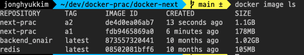
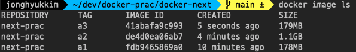
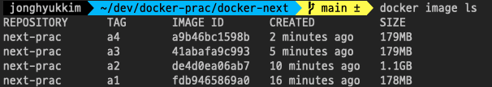
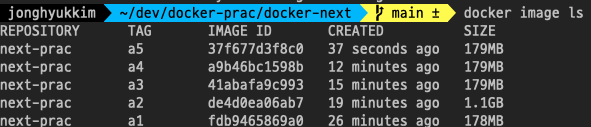
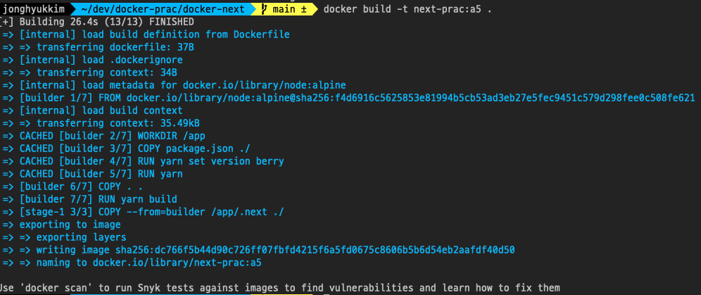
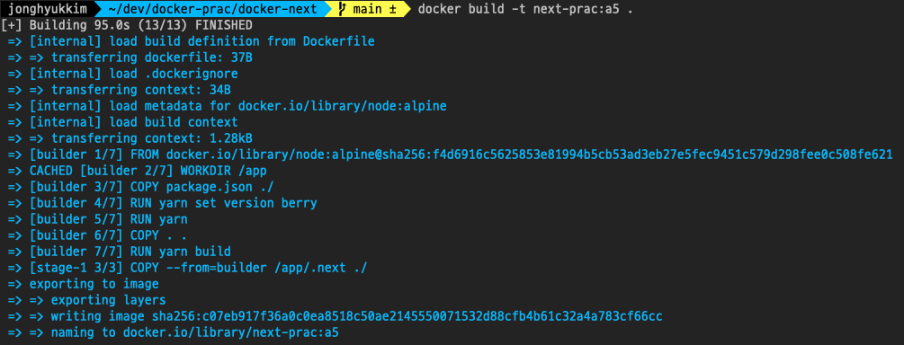

# Next App 도커 이미지 말아보기

## 멀티스테이지 끄기(next-prac:a2)

개큼 1.1GB



## 체이닝 + 멀티스테이지 (next-prac:a3)

179 MB



## 체이닝 X + 멀티스테이지 (next-prac:a4)

179 MB - 별 차이 없음. 단순히 채이닝한다고 해서 문제가 아니라 RUN 과정에서 생성/삭제되는 무언가가 있는지가 더 중요한듯?



## 의존성 따로 옮기기 + 멀티스테이지(next-prac:a5)



- 이거는 소스코드 수정 후 이미지를 다시 만들때의 문제인데, 이렇게 쓰면 의존성이 변경되었을 경우에만 package.json을 옮기는 것을 다시 실행하고 yarn install을 함(이미지 빌드 캐시)
- 근데 이게 맞나 레이어를 어디까지 재사용할 수 있는지에 대한... 도커의 판단기준이 있는듯
- 크기에는 차이 없음

### 소스코드 수정 후 이미지 재생성시 캐시 빌드

yarn까지 캐시함(26s), 빌드만 다시함



### 의존성 수정 후 이미지 재생성시 캐시 빌드

COPY 까지 캐시함(95s) - 캐시 안하는거나 다름 없음



어떤 파일이 수정될지, 도커 명령어의 의존성을 스탭 안에서 정확하게 나눠야함.

그렇다면 빌드에 필요한 최소 파일만 순차적으로 옮긴다고 치면, 캐시를 더더 잘 사용할 수 있지 않을까? 싶긴 한디 COPY가 병목이 될것같지는 않긔

## 최종 Dockerfile

```dockerfile
FROM node:alpine AS builder
WORKDIR /app
COPY package.json ./
RUN yarn set version berry
RUN yarn
COPY . .
RUN yarn build

FROM node:alpine
WORKDIR /app
COPY --from=builder /app/.next ./
CMD ["yarn", "start"]
```

- WORKDIR은 생성되는 이미지의 디렉토리 -> 컨테이너에서도 이렇게 될 것
- COPY는 앞이 현재 디렉토리, 뒤가 생성되는 이미지의 디렉토리

## outputstandalone 옵션

- .next/standalone 디렉토리로 node_modules 설치 없이 바로 빌드 결과물을 제공한다구 하는데... 이거는 추후 mf poc에서 tracing 옵션을 다뤄보면서 공부해보기로 하쟈

## 모노레포에서는

어캐할 수 있을까..
